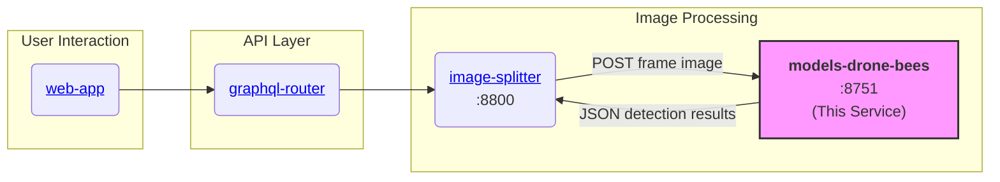

# Gratheon / models-drone-bees

Machine learning microservice for automatic detection and classification of **worker bees and drone bees** in beehive frame images.
Original work done as [a project for Machine Learning course in the University of Tartu (2025)](https://github.com/KreeteKuusk/Bee-type-detection-ML2025)

## Overview

The `models-drone-bees` service is a specialized ML microservice within the Gratheon platform that detects and classifies honey bees into two categories: worker bees and drone bees. This service helps beekeepers monitor the composition of their colonies, which is crucial for hive health assessment.

The service is built on **YOLOv10** architecture, selected after comparative evaluation of multiple object detection models (YOLOv8, YOLOv10, YOLOv12, RT-DETR). It handles severe class imbalance through dataset balancing techniques and uses high-resolution image preprocessing with tiling for improved detection accuracy.

**Key Responsibilities:**

- Accept image uploads via HTTP API
- Detect and classify worker bees and drone bees in frame images
- Return bounding box coordinates with confidence scores
- Provide aggregated counts for each bee type
- Support both web form and programmatic API access

## Architecture

### Service Integration Diagram



### Technology Stack

- **Language**: Python 3
- **ML Framework**: Ultralytics YOLOv10
- **Computer Vision**: OpenCV, NumPy
- **HTTP Server**: Python `http.server.ThreadingHTTPServer`
- **Containerization**: Docker, Docker Compose
- **Model Weights**: Custom trained on Mississippi State University dataset

### Repository Structure

The repository is organized into two main directories:

- **Model_selection**: Comparative experiments with multiple object detection architectures (YOLOv8, YOLOv10, YOLOv12, RT-DETR) to evaluate baseline performance under controlled preprocessing and augmentation settings.

- **project_beedetection**: Full detection pipeline based on YOLOv10, including high-resolution image preprocessing, image tiling, dataset augmentation and balancing, manual dataset curation, and final model training and evaluation.

## Model Details

### Model Selection

Model selection experiments used a publicly available dataset from **Roboflow**. The dataset is highly imbalanced with a **drone-to-worker bee ratio of 34.3:1**. All images were resized to **640 × 640 pixels** with data augmentation applied:
- Two augmented variants per image
- Grayscale transformation (15% of samples)
- Random noise (up to 1.96% of pixels)
- Dataset split: **40/5/5** ratio (train/validation/test)

### Final Model: YOLOv10

Based on model selection results, **YOLOv10** was selected for production use. A larger dataset was sourced from the **Mississippi State University GRI Publications database** with additional preprocessing:
- Image tiling for high-resolution processing
- Manual dataset inspection and curation
- Multiple training runs on balanced and imbalanced datasets

**Dataset source**: [Mississippi State University GRI Publications](https://scholarsjunction.msstate.edu/gri-publications/4/)

## Development

### Prerequisites

- Docker and Docker Compose
- Python 3.8+ (for local development)
- CUDA-capable GPU (optional, for faster inference)

### Installation

Clone the repository:
```bash
git clone https://github.com/Gratheon/models-drone-bees.git
cd models-drone-bees
```

### Running the Service

Start the service in development mode:
```bash
just start
```

Start in production mode:
```bash
just start-prod
```

Run locally without Docker:
```bash
just run-local
```

Stop the service:
```bash
just stop
```

View logs:
```bash
just logs
```

The service will be available at `http://localhost:8751`

### Environment Variables

Configure the service using these environment variables (set in `docker-compose.yml`):

- `PORT`: Server port (default: 8751)
- `ENV_ID`: Environment identifier (`dev` or `prod`)
- `CONF_THRESHOLD`: Detection confidence threshold (default: 0.25)
- `IOU_THRESHOLD`: Intersection over Union threshold for NMS (default: 0.7)
- `IMG_SIZE`: Image size for inference (default: 1280)
- `MAX_DETECTIONS`: Maximum number of detections per image (default: 300)
- `MODEL_WEIGHTS`: Path to model weights file

## API Documentation

### Base URL

- Development: `http://localhost:8751`
- Production: Accessed via `image-splitter` service

### Endpoints

#### GET /

Web form interface for manual testing. Opens an HTML page with file upload form.

**Response**: HTML page with upload form

#### POST /

Process image and detect bees.

**Request**:
- Method: POST
- Content-Type: `multipart/form-data`
- Body: File field named `file` containing the image

**Response**:
```json
{
  "message": "File processed successfully",
  "result": [
    {
      "x1": 100.5,
      "y1": 200.3,
      "x2": 150.7,
      "y2": 250.8,
      "confidence": 0.85,
      "class": 0,
      "class_name": "worker"
    },
    {
      "x1": 300.2,
      "y1": 150.1,
      "x2": 350.4,
      "y2": 200.3,
      "confidence": 0.78,
      "class": 1,
      "class_name": "drone"
    }
  ],
  "count": 2,
  "worker_count": 1,
  "drone_count": 1
}
```

**Example using curl**:
```bash
curl -X POST -F "file=@image.jpg" http://localhost:8751
```

**Example using Python**:
```python
import requests

url = "http://localhost:8751"
files = {"file": open("image.jpg", "rb")}
response = requests.post(url, files=files)
print(response.json())
```

## Inference Options

### Option 1: HTTP Server (Recommended)

The service runs as an HTTP server (see Development section above).

Access the service via:
- Web form: `http://localhost:8751`
- API endpoint: POST to `http://localhost:8751` with `file` field

### Option 2: CLI Script

Run inference directly on images using the command-line interface:

```bash
python inference.py path/to/image.jpg
python inference.py path/to/image.jpg --conf 0.5 --imgsz 1280
python inference.py folder/ --output results/
```

**CLI Arguments**:
- `--model`: Path to model weights (default: best trained model)
- `--imgsz`: Inference image size (default: 1280)
- `--conf`: Confidence threshold (default: 0.25)
- `--output`: Output directory for results
- `--no-save`: Don't save annotated images
- `--show`: Display results

## Testing

Test the running server:
```bash
just test
```

This sends a GET request to verify the server is responding.

## License

This project is released under a dual-license model:

- **MIT License**: For open-source use. See [LICENSE](LICENSE) file for details.
- **Commercial License**: For commercial use within the Gratheon platform. See [LICENSE-COMMERCIAL.md](LICENSE-COMMERCIAL.md) for details.

The project uses Ultralytics YOLOv10, which is available under:
- **GPL-3.0 License**: For open-source use
- **Enterprise License**: For commercial product development (see [Ultralytics Licensing](https://ultralytics.com/license))

